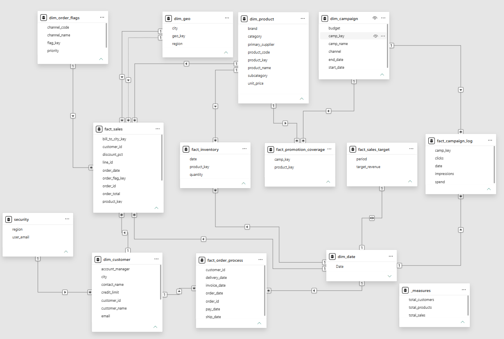

# Enterprise Multi-Fact Data Model (Retail & Operations)



## Executive Summary
This project demonstrates an **Enterprise-Grade Data Model** built using **Power BI**, following the **Constellation (Multi-Fact) Schema** architecture. The model integrates disparate operational data sources (Sales, Inventory, Marketing Campaigns, Order Processing, and Targets) into a unified analytical data warehouse framework.

---

## Data Architecture & Schema Design
The data model transitions from raw, unnormalized transactional tables into a consolidated **Multi-Fact Star Schema** with conformed dimensions.

### Model Components:
* **Architecture Style:** Constellation (Multi-Fact) Schema
* **Fact Tables (6):** `fact_sales`, `fact_inventory`, `fact_campaign_log`, `fact_promotion_coverage`, `fact_order_process`, `fact_sales_target`
* **Dimension Tables (5):** `dim_product`, `dim_customer`, `dim_geo`, `dim_campaign`, `dim_order_flags`
* **Security & Utility Tables (2):** `security`, `_measures`

---

## Key Technical Highlights & Modeling Best Practices

1. **Conformed Dimensions Integration:**
   * Dimensions like `dim_product`, `dim_customer`, and `dim_geo` seamlessly connect to multiple fact tables (`fact_sales`, `fact_inventory`, `fact_order_process`), enabling cross-functional analytical slicing.

2. **Granularity & Bridge Table Handling:**
   * Managed many-to-many relationship dynamics between marketing campaigns and promoted SKUs using `fact_promotion_coverage` as a bridge table.
   * Handled mismatched time-grain levels between daily transactional sales and monthly targets (`fact_sales_target`).

3. **Data Transformation & ETL (Power Query):**
   * Standardized raw customer and order files across multiple years (`ORDERS_2025`, `ORDERS_2026`).
   * Created surrogate keys (`product_key`, `geo_key`, `order_flag_key`, `camp_key`) to ensure robust dimensional join performance.

4. **Row-Level Security (RLS) & Governance:**
   * Implemented dynamic data access controls via the `security` table mapping user emails to allowed geographic regions (`UserEmail` $\rightarrow$ `Region`).

5. **Centralized Measure Repository:**
   * Isolated all DAX analytics logic inside a dedicated `_measures` table to enforce enterprise data governance and maintain clean schema organization.

---

## Data Dictionary
For full column-level descriptions, data types, and primary/foreign key mappings, refer to [docs/data_dictionary.md](data/data_dictionary.md).

---

## Analytical Dashboards Breakdown
The model is structured to support 4 specialized Power BI analytical views:
1. **Executive Sales & Revenue Attainment:** Tracks performance against target revenue, customer purchase behavior, and product line growth.
2. **Marketing Campaign ROI:** Evaluates ad spend, CTR, impression volume, and revenue attribution per promotional campaign.
3. **Fulfillment & Order Process Dynamics:** Analyzes order lifecycle lead times (Order Date $\rightarrow$ Ship Date $\rightarrow$ Delivery Date $\rightarrow$ Payment Date).
4. **Inventory Level & Supply Chain Risk:** Monitors stock availability and fast/slow-moving inventory items.
1. Clone this repository:
   ```bash
   git clone [https://github.com/your-username/enterprise-powerbi-data-model.git](https://github.com/your-username/enterprise-powerbi-data-model.git)
